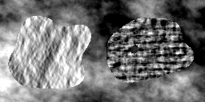

# Textured blob generator

This repository contains a bunch of scripts I wrote during my PhD to generate artificial textured images like this one: 



These images have been used to evaluate the accuracy of texture-based segmentation algorithms.

These scripts relies on the utilities provided by [ImageMagick](http://www.imagemagick.org/script/index.php) (see your package manager to install it), and have only been used on Linux systems.

## `generate-rpn-images.rb`

The [random phase noise](http://www.ipol.im/pub/art/2011/ggm_rpn/) (RPN) algorithm is used to perform texture synthesis, which consists in generating a texture image similar to a given sample.

This script use it to transform some images into micro textures. If the image used as seed already represents a micro texture, the resulting image will be very similar. If not, the generated image may be very different, but it will still be a micro texture.

```
$ ./generate-rpn-images.rb -h
Usage: generate-rpn-images [options]
    -h, --help                       Display this help.
        --rpn                        Path of the random_phase_noise executable.
    -s, --seeds DIR                  The directory containing the images to be used as seeds (must be PNGs).
    -x INTEGER                       The width of the output images (must be greater than the width of the seeds). Default: 512.
    -y INTEGER                       The height of the output images (must be greater than the height of the seeds). Default: 512.
    -o, --output DIR                 The directory where generated images will be stored.
```

Note: The [Brodatz](http://www.ux.uis.no/~tranden/brodatz.html) image database is a good source of seed images.

## `generate-blobs.rb`

This scripts relies on the [`randomblob`](http://www.fmwconcepts.com/imagemagick/randomblob/index.php) script to generate a bunch of random black and white blobs, like this one:


To use it, you will need to install the `randomblob` mentioned above and the `convert` utility from the `imagemagick` package. 

```
$ ./generate-blobs.rb -h
Usage: generate-blobs [options]
    -h, --help                       Display this screen
        --rb PATH                    Path of the randomblob executable.
    -n NUM                           Number of blobs to generate
    -s INTEGER                       Size of the generated image. Default: 256.
    -o DIR                           The output folder
```

Note: this script will place each image in a separate directory, so you can associate other images to it (binary masks, training sets...).

## `generate-dataset.rb`

Given a set of black and white blobs and a set of textures, this script will generate a `yaml` file describing a set of textured blobs. This file will serve as an input for the following scripts.

```
$ ./generate-dataset.rb -h
Usage: generate-dataset [options]
    -h, --help                       Display this screen
    -b, --blobs DIR                  The folder containing the blobs
    -t, --textures DIR               The folder containing the textures
    -n, --number NUM                 Number of images to generate
    -c, --count NUM                  Number of blobs per image
```

Note: the generated file is printed to the standard output. You need to save it to a `yaml` file. The images will later be generated in the directory containing this file, so place it in a separate directory.

## `compose-textured-blobs.rb`

Using the file generated by the `generate-dataset.rb` scripts, the set of textured blob will be generated.

The blobs will be generated in the same folder as the description file.

## `import-groundtruths.rb`

This script generates index-based images representing the different regions of the image: each blob will have a value (starting at 1) while the background will have the value 255.

./import-groundtruths.rb -h
Usage: import-groundtruths [options]
    -h, --help                       Display this screen
    -d, --dataset-description FILE   The dataset description yaml file

## `import-masks.rb`

Generates binary masks for each blob of each image in the description file.

```
 ./import-masks.rb -h
Usage: import-masks [options]
    -h, --help                       Display this screen
    -d, --dataset-description FILE   The dataset description yaml file
    -n, --name NAME                  The learning set to import
```

If the `name` parameter is `groundtruth`, the masks will be generated using the blobs. Otherwise, it will look for a directory having this name in the blob directory. Your directory structure must then be:

```
blobs
  001
    blob
      000000.png
    mask // The name you have to specify with the -n parameter
      000 // For the inner part of the blob.
        000000.png
      001 // For the background part of the blob
        000000.png
  ...
```

Note: all background masks will be combined in a single background mask.

## License

These tools are released under the terms of the MIT License. See the LICENSE.txt file for more details.